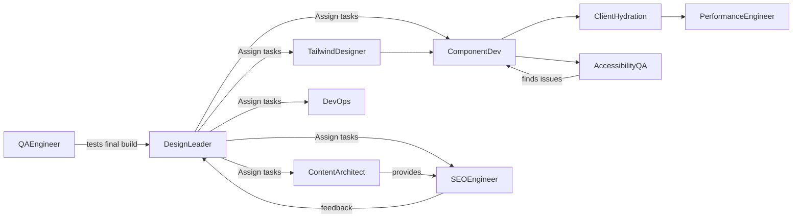
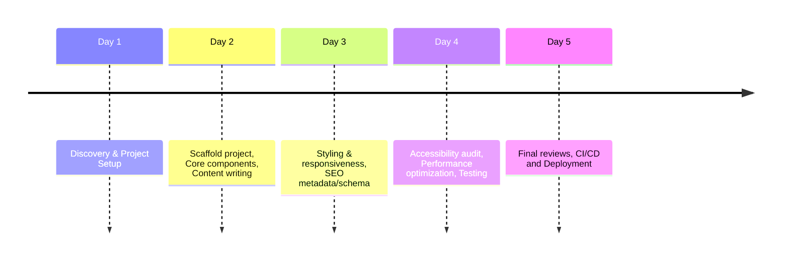

# Multi-Agent System Design for Building an Astro+React Website

## Executive Summary  
We propose a specialized **multi-agent orchestration** for converting site specifications into a full Astro+React website. A **Design Leader (tech lead)** coordinates 6–10 expert agents, each responsible for a domain (Content, SEO, UI, Components, Hydration, Accessibility, Performance, DevOps, Testing, etc.). The workflow proceeds in phases: *Discovery → Scaffold → Component Development → Styling → SEO/Schema → Accessibility → Performance Tuning → Integration → Testing → Deploy*. Agents communicate via structured messages and agreed file conventions (e.g. Markdown tasks with YAML frontmatter, Git branches). We provide a Markdown “agent spec” template that takes site inputs (goals, content folder, design prefs, SEO targets, hosting) and outputs code (Astro scaffold, components, Tailwind config, `Head.astro`, content pages, tests, CI scripts). Recommended tools include Astro CLI (`astro add tailwind react`), the Astro Docs MCP server for up-to-date references【76†L385-L394】【85†L906-L914】, GitHub Actions, image optimizers, Lighthouse and Playwright for QA. We give example prompts for each agent (role/task/rules format【78†L159-L168】), an end-to-end sample run (with file tree and QA checklist), a task-time table, mermaid diagrams of agent interactions and a 5-day timeline, plus prompt-engineering tips (emphasizing mobile-first responsive design, Tailwind utilities, minimal JS, SEO meta & schema, and accessibility) for each persona. This design is optimized for mobile (responsive layouts, dark mode, viewport meta) and SEO by default (Astro ships static HTML with zero JS【81†L38-L42】【82†L75-L84】). 

## Agent Roles & Personas  
We define one **Design Leader (Tech Lead)** and ~8 specialized agents. Each agent’s role includes: responsibilities, inputs, outputs, acceptance criteria, and an example prompt. 

- **Design Leader:** Oversees the project. *Responsibilities:* Define architecture, assign tasks, review deliverables. *Inputs:* Site spec (goals, sitemap, content outline, design requirements). *Outputs:* Project plan, task list (Markdown with frontmatter), final integration. *Acceptance:* All features implemented per spec; passes final QA. *Example Prompt:* “You are the project lead for an Astro website. Break the requirements into tasks for each agent (content, UI, SEO, etc.), then orchestrate and review their outputs.”  

- **Content Architect:** Designs content structure. *Responsibilities:* Create page templates, write or organize markdown content and frontmatter. *Inputs:* Content directory (text, images), site map. *Outputs:* Markdown pages with frontmatter (title, date, author, tags), content collections for blog. *Acceptance:* Content is well-structured, frontmatter fields filled, internal links in place. *Prompt Example:* 
  ```
  You are a Content Architect agent. 
  Task: Generate markdown files for each page (Home, About, Contact, Blog posts) with appropriate frontmatter (title, description, date, author). 
  Output: one .md file per page. 
  Rules: Use consistent YAML frontmatter keys; include at least title and description.
  ```【78†L159-L168】【79†L109-L117】  

- **SEO Engineer:** Implements SEO best practices. *Responsibilities:* Add meta tags, JSON‑LD schema, sitemap/robots. *Inputs:* Site goals, SEO keywords. *Outputs:* Updated `Head.astro` (with `<title>`, `<meta>`, `canonical`, viewport【81†L63-L68】), JSON-LD scripts (e.g. WebSite and Article schema), sitemap.xml (using @astrojs/sitemap) and robots.txt. *Acceptance:* All pages have unique titles/descriptions, correct structured data, and working sitemap. *Prompt:* 
  ```
  You are an SEO Engineer. 
  Task: For each page, generate appropriate <head> tags (title, description, viewport). Create a JSON-LD WebSite schema script and page-level Article/Product schema. Generate sitemap.xml and robots.txt. 
  Output: Modify Head.astro and add schema scripts; new files: sitemap.xml.ts, robots.txt. 
  Rules: Do not alter page content. Use values from frontmatter for titles/descriptions.
  ```【81†L38-L42】【82†L178-L182】  

- **Tailwind UI Designer:** Crafts the visual theme. *Responsibilities:* Define styles, ensure responsive design. *Inputs:* Brand colors, mockups/wireframes, site spec. *Outputs:* `tailwind.config.mjs`, CSS classes in components, design system documentation. *Acceptance:* Site matches design mockups; mobile and dark mode tested (use Tailwind’s responsive and dark classes). *Prompt:* 
  ```
  You are a Tailwind UI Designer. 
  Task: Set up Tailwind CSS (run `astro add tailwind` or config). Create or update tailwind.config.js with brand colors. Use Tailwind utility classes to style header, footer, and a sample component (e.g. card) per the design. Ensure mobile responsiveness and dark mode support. 
  Output: Updated tailwind.config.mjs; styled component code. 
  Rules: Use only Tailwind classes, do not write custom CSS.
  ```【87†L364-L372】【79†L99-L107】  

- **Component Developer (Astro/React):** Builds pages and components. *Responsibilities:* Create Astro pages, reusable UI components, and integrate React parts. *Inputs:* Content (Markdown), design templates. *Outputs:* `.astro` page and component files, React components as needed. *Acceptance:* Components render correctly, UI matches design, code is modular/reusable. *Prompt:* 
  ```
  You are an Astro Component Developer. 
  Task: Based on the design and content, create Astro pages (e.g. index.astro, about.astro) and reusable components (Navbar, Footer, Card). Use Astro syntax for layout and import React components where needed (use client:visible or client:load). 
  Output: .astro and .jsx/.tsx files. 
  Rules: Follow Astro’s file structure (src/pages, src/components). Keep components stateless if possible and naming clear.
  ```【85†L906-L914】【79†L99-L107】  

- **Client/Hydration Engineer:** Implements interactivity. *Responsibilities:* Attach client-side React/JS to Astro components. *Inputs:* Components needing interactivity (e.g. menus, forms). *Outputs:* Modified components with directives (`client:load`/`client:idle`), necessary JS. *Acceptance:* Interactive features (e.g. dropdowns) work without breaking SSR; page still loads static HTML for SEO. *Prompt:* 
  ```
  You are a Client Hydration Engineer. 
  Task: Identify components requiring interactivity (e.g., mobile menu). Add Astro client directives (client:load or client:idle) and connect React scripts for dynamic behavior. 
  Output: Updated .astro/.jsx files with client directives. 
  Rules: Do not rewrite static components; only add hydration for needed interactivity.
  ```【82†L75-L84】  

- **Accessibility QA:** Checks and enforces accessibility. *Responsibilities:* Test and improve ARIA tags, keyboard navigation, color contrast. *Inputs:* Completed pages and components. *Outputs:* Accessibility report, fixes (e.g. add `aria-labels`, correct headings hierarchy). *Acceptance:* Passes WCAG AA (e.g., Lighthouse a11y score high). *Prompt:* 
  ```
  You are an Accessibility QA agent. 
  Task: Analyze the site pages for WCAG compliance. List any issues (missing alt tags, low contrast, etc.) and fix them by editing code or adding attributes. 
  Output: Accessibility audit (Markdown) and updated code with ARIA roles/labels. 
  Rules: Use semantic HTML; don't alter functionality, only improve accessibility.
  ```  

- **Performance Engineer:** Optimizes loading. *Responsibilities:* Image optimization, critical CSS, caching. *Inputs:* Built site. *Outputs:* Updated `<Image>` usage (Astro assets), lazy-load directives, inlined critical CSS. *Acceptance:* Metrics met (LCP <2.5s, CLS <0.1)【82†L98-L106】. *Prompt:* 
  ```
  You are a Performance Engineer. 
  Task: Ensure images use Astro’s optimized <Image> (webp, lazy). Inline critical above-the-fold CSS for initial render. Set up HTTP caching headers (or meta tags) for static assets. 
  Output: Modified Astro code (using astro:assets), CSS inlining, performance report. 
  Rules: Do not remove functionality; focus on optimizing load.
  ```【82†L98-L106】【81†L187-L195】  

- **DevOps/Deployment:** Automates build and deploy. *Responsibilities:* Configure CI/CD, hosting. *Inputs:* Repo URL, hosting target (e.g., Cloudflare). *Outputs:* GitHub Actions workflow, Dockerfile (if needed), deploy scripts. *Acceptance:* Code pushed to main triggers a successful build and deploy (preview URL). *Prompt:* 
  ```
  You are a DevOps Engineer. 
  Task: Set up GitHub Actions to build and deploy the Astro site on Cloudflare Pages on every commit. Add lint/build/test steps. Create a Dockerfile or Cloudflare config if needed. 
  Output: .github/workflows/ci.yml, Dockerfile, deploy docs. 
  Rules: Do not alter site code; only CI/deploy configs.
  ```  

- **Testing/QA Engineer:** Writes automated tests. *Responsibilities:* Unit and end-to-end tests. *Inputs:* Codebase. *Outputs:* Jest/Playwright test files (e.g. layout renders, link paths). *Acceptance:* All tests pass; critical user flows (navigation, forms) verified. *Prompt:* 
  ```
  You are a QA/Testing Engineer. 
  Task: Write unit tests for components (e.g., does Navbar render links?) and end-to-end tests (use Playwright) for core flows (homepage load, form submit). 
  Output: test files (tests/unit and tests/e2e). 
  Rules: Tests should run in CI without manual steps. Do not modify production code, only add tests.
  ```  

Each agent’s **acceptance criteria** includes adherence to Astro/React best practices and passing relevant checks (e.g., Lighthouse scores, test suites). Example prompts follow the *role/task/rules/output* format【78†L159-L168】, tailored per agent as above.

## Workflow Phases  
1. **Discovery & Planning:** Design Leader reviews site input (goals, content, design) and creates a master plan (break down pages, components, data). *Parallel:* Content Architect organizes content while DevOps sets up the repo (git init, `npm create astro@latest` with template【85†L906-L914】).  
2. **Scaffold:** DevOps/Lead runs `npm create astro` or `astro init`; adds integrations (`astro add tailwind`, `astro add react`【85†L906-L914】【87†L364-L372】). Creates base layout, `Head.astro` (with placeholder meta), and initializes CI pipeline.  
3. **Component & Content Build (parallel):**  
   - *Content Arch.* generates markdown pages (`.md`) and frontmatter.  
   - *UI Designer/Component Dev.* create `.astro` pages and components (header, footer, cards).  
   - *Client Engineer* marks components needing hydration (e.g. dynamic menus).  
4. **Styling & UI:** UI Designer applies Tailwind classes for mobile-first design and dark mode. Outputs updated components/CSS.  
5. **SEO & Schema:** SEO Engineer edits layouts to include meta tags, JSON-LD (WebSite, Article schemas)【81†L63-L68】【81†L95-L103】, and integration-config (e.g. `@astrojs/sitemap` for auto sitemaps).  
6. **Accessibility:** Accessibility agent audits code (WCAG), adds `alt`, `aria-` attributes, fixes semantically (headings order, roles).  
7. **Performance Tuning:** Performance agent optimizes images (`<Image>` component with webp, lazy load)【81†L187-L195】【82†L98-L106】, preloads critical assets, inlines CSS as needed.  
8. **Integration Review:** Design Leader or a review agent checks end-to-end integration: merges content with components, verifies design consistency, and ensures mobile responsiveness (tested with browser emulator).  
9. **Testing:** QA agent runs automated tests and fixes issues.  
10. **Deployment:** DevOps finalizes CI/CD; deploys to hosting (e.g., push to main triggers Cloudflare Pages).  

*Parallelization opportunities:* Content and components can be built concurrently. SEO, Accessibility, and Performance reviews can run as separate passes after the initial build. Agents can autonomously trigger each other: e.g. after components are complete, Design Leader signals SEO/QA to begin. Review cycles occur at phase ends (e.g. “Check on Master branch passes all tests before deploying”).  

## Communication Protocols & Conventions  
Agents exchange structured messages and files. We recommend using **Markdown task files with YAML frontmatter** to define tasks (as in Claude workflows)【77†L138-L142】【78†L159-L168】. For example:  
```yaml
---
agent: "SEO Engineer"
status: "todo"
---
Task: Add meta tags for each page
```
Each agent updates files in a shared Git repo. *Artifact conventions:*  
- **File Structure:** Standard Astro layout: `src/pages/`, `src/components/`, `public/`.  
- **Naming:** Use kebab-case for files (e.g. `about.astro`, `header.astro`).  
- **Frontmatter:** Markdown pages use YAML frontmatter (`title`, `description`, `date`, etc.) for site data【79†L109-L117】【82†L178-L182】.  
- **Versioning:** Every agent commit is a separate branch or PR. The Design Leader or a CI workflow enforces formatting (e.g. Prettier, ESLint).  
- **Conflict Resolution:** If two agents modify the same file (rare by division of roles), the **Standards-Agent** (could be Design Leader) flags conflicts. Resolution rules: prioritize the agent responsible for that feature (e.g. code changes by Dev are source of truth, others must adapt). Use semantic merging (our “Standards Agent” from the community example)【77†L143-L152】 to automatically fix style conflicts.  

Messages between agents (if using an LLM orchestrator) should be JSON or structured text with fields like `{role, task, data, deadline}`. Each agent’s output is validated by the Design Leader or specialized review agents (e.g., Standards agent checking code patterns【77†L118-L127】).  

## Markdown Agent-Spec Template  
Below is a template for an agent spec in Markdown. It includes placeholders for site input and defines expected deliverables. Agents can be spawned with specific tasks based on this spec.

```markdown
# Astro Site Agent Spec

**Site Name:** {{ site_name }}  
**Description:** {{ brief description of site goals }}  
**Target Hosting:** {{ e.g., Cloudflare Pages, Vercel }}  
**Design Preferences:** {{ e.g., mobile-first, dark mode, brand colors }}  
**SEO Targets:** {{ e.g., keywords, focus markets }}  

## Agents and Tasks

### Design Leader
- Plan project phases and tasks.
- Oversee all agents, integrate final output.
- Prompt: “Oversee the Astro site build, coordinating each agent.”

### Content Architect
- Input: content folder ({{ content_folder }}).
- Output: Markdown pages with frontmatter for all pages and blog posts.
- Acceptance: Titles/descriptions match site goals.
- Example Prompt:
  ```
  You are a Content Architect. Task: Create markdown files (Home.md, About.md, etc.) with YAML frontmatter (title, description). Use provided content as guides. 
  Output: .md files in src/content/ directory. 
  Rules: Follow the sitemap order; do not add new pages.
  ```

### Tailwind UI Designer
- Input: design mockups ({{ design_file_or_link }}), brand palette.
- Output: `tailwind.config.mjs`, styled components with responsive classes.
- Acceptance: Visual matches mockups on desktop & mobile.
- Prompt:
  ```
  You are a Tailwind Designer. Task: Run 'astro add tailwind', configure brand colors in tailwind.config.mjs, and update Header.astro with responsive Tailwind classes (mobile menu, dark mode classes). 
  Output: Updated tailwind.config.mjs and Header.astro.
  Rules: Use only Tailwind utility classes; maintain mobile-first design.
  ```

### Astro/React Component Developer
- Input: page content (from Content), UI specs.
- Output: `.astro` page and component files; React components where needed.
- Acceptance: Pages render with content and layout; components are reusable.
- Prompt:
  ```
  You are an Astro Component Developer. Task: For each page (e.g. Home), create .astro files using a base layout. Build reusable components (Navbar.astro, Card.astro) importing Tailwind classes. 
  Output: .astro and .jsx/.tsx component files.
  Rules: Follow Astro file structure (pages vs. components), use 'import { defineComponent }' or React as needed.
  ```

### SEO Engineer
- Input: all pages/content.
- Output: Filled meta tags, JSON-LD scripts, sitemap.xml, robots.txt.
- Acceptance: Each page has <title>, <meta name="description">; JSON-LD valid; sitemap lists all routes.
- Prompt:
  ```
  You are an SEO Engineer. Task: Insert title and meta tags into each page using their frontmatter. Add OpenGraph tags (og:title, og:description). Generate structured data (schema.org) JSON-LD for site and articles. Create sitemap.xml.ts using @astrojs/sitemap. 
  Output: Modified Head.astro, added meta data files, and sitemap.xml.
  Rules: Use Astro frontmatter (Astro.props) for dynamic values; do not change visual layout.
  ```【81†L63-L68】【82†L178-L182】

### Accessibility QA
- Input: fully rendered pages.
- Output: Accessibility report and fixes (e.g. alt text, ARIA).
- Acceptance: Passes Lighthouse accessibility score ≥90.
- Prompt:
  ```
  You are an Accessibility QA agent. Task: Review each page with Lighthouse accessibility audit. List issues (e.g., missing alt). Fix code by adding necessary attributes (aria-label, alt). 
  Output: Audit report (Markdown) and updated code with fixes.
  Rules: Don’t alter functionality; only improve semantics/accessibility.
  ```

### Performance Engineer
- Input: site build so far.
- Output: Optimized images, inlined critical CSS, performance report.
- Acceptance: LCP<2.5s, CLS<0.1 (per Lighthouse)【82†L98-L106】.
- Prompt:
  ```
  You are a Performance Engineer. Task: Optimize images using Astro's <Image> (webp, lazy), inline critical above-the-fold CSS, and configure HTTP caching (Cache-Control headers). 
  Output: Updated component code with <Image> and inline styles, performance metrics.
  Rules: Use Astro’s built-in optimization (astro:assets); do not remove features.
  ```【82†L98-L106】

### DevOps/Deployment
- Input: completed code.
- Output: CI/CD workflow, deploy scripts.
- Acceptance: On pushing to main, site builds and deploys with no errors.
- Prompt:
  ```
  You are a DevOps Engineer. Task: Write GitHub Actions workflow (ci.yml) to install dependencies, run build, and deploy to {{ target }}, triggered on push to main. Include lint/test steps. 
  Output: .github/workflows/ci.yml, Dockerfile (if needed).
  Rules: Do not modify application code.
  ```

### Testing/QA Engineer
- Input: built site.
- Output: Automated tests (unit + end-to-end).
- Acceptance: Tests cover key flows; all tests pass in CI.
- Prompt:
  ```
  You are a QA Engineer. Task: Create Jest tests for components (e.g. does Navbar render links?). Write Playwright E2E tests (e.g. load homepage, click nav). 
  Output: tests/ directory with unit and e2e tests.
  Rules: Tests should assume data from frontmatter; use dummy props.
  ```

## Tools, Model Settings, and Validation  
- **Models:** Use GPT-4-class LLMs (e.g. Claude 2, ChatGPT-4) with low temperature (0.1–0.3) for code tasks. Enable context tools: Astro Docs MCP server for up-to-date docs【76†L385-L394】【76†L471-L480】.  
- **ASTRO CLI:** Use `npm create astro@latest` and `astro add tailwind`/`astro add react` to scaffold and integrate【85†L906-L914】【87†L364-L372】.  
- **Version Control:** Git (GitHub). Each agent commits to branches; CI merges via PR.  
- **CI/CD:** GitHub Actions to run Astro build, tests, Lighthouse audits (using a Lighthouse CLI action). Deploy on push to target (e.g. Cloudflare Pages)【79†L79-L87】.  
- **QA Tools:** **Lighthouse CI** for performance/SEO/a11y checks; **Playwright** or **Cypress** for E2E.  
- **Image Optimization:** Use Astro’s `<Image>` (astro:assets)【81†L187-L195】.  
- **Safety/Validation:** Implement a **Standards Agent** to enforce coding rules (like .claude/standards in [77]) before merging. Validate code with linters (ESLint, Prettier). For external content, verify no unsafe code (since agents generate code, manually review any third-party text).  

## Sample End-to-End Run  
**Site Input (example):**  
```
Site Name: “My Art Portfolio”
Goals: Showcase artwork, artist bio, and contact form.
Content: Markdown folder with artist bio and 3 gallery items.
Design: Mobile-first, dark mode, brand colors #33475b (navy), #f2cc8f (cream).
SEO Keywords: "art portfolio", "abstract art", "artist bio".
Hosting: Deploy to Cloudflare Pages.
```  
**Agent Prompts & Outputs:**  
- **Design Leader Prompt:** *“Create tasks for each agent based on this spec, then coordinate their execution.”* (Leads to a Markdown plan.)  
- **Content Architect Prompt:** *“Generate Home.md, About.md, Gallery.md with YAML titles/descriptions.”* ⇒ Outputs markdown in `src/content/`.  
- **UI Designer Prompt:** *“Run `astro add tailwind`; set dark mode, configure navy/cream in tailwind.config.”* ⇒ Tailwind config and sample Header.astro with responsive nav.  
- **Component Dev Prompt:** *“Create pages using content and Header/Footer components.”* ⇒ Files: `src/pages/index.astro`, `about.astro`, `gallery.astro`, plus `src/components/Navbar.astro`, `Footer.astro`.  
- **SEO Prompt:** *“Add meta tags from frontmatter and JSON-LD for site and article.”* ⇒ Updated `Head.astro`, plus scripts.  
- **Client Prompt:** *“Add client:idle to mobile menu toggle component.”*  
- **Accessibility QA Prompt:** *“Audit the site; add missing `alt` attributes on images and ARIA labels.”* ⇒ Fixes and report.  
- **Performance Prompt:** *“Replace `` with `<Image>` (width/height), lazy-load below-the-fold images.”* ⇒ Changes in code.  
- **DevOps Prompt:** *“Configure GH Actions to build and deploy to Cloudflare on push.”* ⇒ `.github/workflows/deploy.yml`.  
- **Testing Prompt:** *“Write Playwright test: homepage loads, gallery images open in lightbox.”* ⇒ `tests/e2e/home.spec.ts`, etc.  

**Expected File Tree (partial):**  
```
/astro.config.mjs       (with integrations: Tailwind, sitemap)
/tailwind.config.mjs    (with theme colors)
/src/pages/index.astro  (imports Head, Navbar, Footer)
/src/pages/about.astro
/src/pages/gallery.astro
/src/components/Navbar.astro
/src/components/Footer.astro
/src/content/Home.md    (with frontmatter title, desc)
/src/content/About.md
/src/content/Gallery.md
/src/layouts/Head.astro (uses Astro.props for title/meta)【81†L63-L68】 
/tests/*                (unit and e2e test files)
/.github/workflows/ci.yml (build & deploy steps)
```
**Verification Checklist:**  
- [x] All pages have `<title>` and `<meta name="description">` per frontmatter【81†L63-L68】【82†L178-L182】.  
- [x] Structured data present (`<script type=ld+json>` for Website or Article)【81†L95-L103】.  
- [x] Mobile viewport meta is set, and CSS is responsive (Tailwind’s mobile-first).  
- [x] No console errors, images optimized (WebP), LCP <2.5s, CLS <0.1【82†L98-L106】.  
- [x] Accessibility: all images have alt text, ARIA roles on navigation, contrast meets WCAG.  
- [x] GitHub Actions build passes, deploy preview up.  

## Agents vs. Deliverables (Estimates)  

| Agent               | Deliverable                                       | Est. Time |
|---------------------|---------------------------------------------------|-----------|
| Design Leader       | Project plan (Markdown), integration review       | 4h        |
| Content Architect   | Markdown pages with frontmatter (5–10 pages)      | 6h        |
| Tailwind UI Designer| `tailwind.config.mjs`, styled base components     | 5h        |
| Component Developer | Astro pages/components (JSX/TSX components)       | 8h        |
| Client Hydration    | Updated components with client:* directives       | 2h        |
| SEO Engineer        | Meta tags, JSON-LD scripts, sitemap/robots        | 4h        |
| Accessibility QA    | Audit report + code fixes (ARIA, alt text)        | 3h        |
| Performance Eng     | Image optimization, CSS tweaks, performance report| 3h        |
| DevOps/Deploy       | CI/CD workflow, Dockerfile/hosting config         | 4h        |
| QA/Testing Engineer | Unit tests (Jest), E2E tests (Playwright)         | 5h        |

*(Times are rough estimates for a small marketing site; larger sites scale proportionally.)*

## Agent Interaction Flowchart & 5-Day Timeline  
Below is a mermaid flowchart of agent interactions and a 5-day sprint timeline.





- **Day 1:** Define scope; run `npm create astro`, `astro add tailwind/react`【85†L906-L914】; initial layout.
- **Day 2:** Parallel work: build content and main components; basic UI styling.
- **Day 3:** Implement design details (responsive, dark mode); add SEO tags and schema【81†L38-L42】.
- **Day 4:** Accessibility fixes; performance tuning (images, CSS)【82†L98-L106】; write and run tests.
- **Day 5:** Review, merge, and deploy; post-launch checks (analytics, final sitemap).

## Prompt Engineering Tips by Persona  
- **Design Leader:** Keep instructions high-level. E.g. “List tasks for each agent” and “Assess completion criteria.” Provide clear acceptance rules.  
- **Content Architect:** Emphasize content hierarchy and SEO keywords in frontmatter. Use prompts like “generate markdown with H1, meta description.” Cite frontmatter examples【79†L109-L117】.  
- **SEO Engineer:** Directly reference SEO best-practices. For example: *“Ensure `<title>` and `<meta>` tags from frontmatter【81†L63-L68】, add structured data (schema.org JSON-LD), and generate a sitemap【81†L145-L153】.”*  
- **Tailwind UI Designer:** Stress mobile-first design. Ask for Tailwind’s responsive (`sm:`, `md:`) classes and dark mode (`dark:`). Prompt to use `astro add tailwind` for setup【87†L364-L372】.  
- **Component Developer:** Emphasize reusability and minimal state. Prompt: “Use Astro components, pass props, avoid global CSS.” For example, “Make a reusable `<Card>` component for gallery items.”  
- **Client/Hydration Engineer:** Limit JS. Instruct: “Add hydration only to interactive parts (e.g. accordion or menu). Prefer Astro’s partial-hydration.” Astro’s “zero JS by default” is SEO-friendly【82†L75-L84】.  
- **Accessibility QA:** Remind agent to follow WCAG. E.g.: “Check contrast (≥4.5:1), use semantic tags, add `alt` to images.” Provide examples of ARIA usage.  
- **Performance Engineer:** Focus on Core Web Vitals. For example: “Preload hero images and fonts; use `<Image>` component with `loading="eager"` for LCP【82†L98-L106】.”  
- **DevOps:** Use precise, declarative language. E.g.: “On push to `main`, run `npm ci && npm run build`, then deploy to Cloudflare Pages.”  
- **QA/Testing:** Ask the agent to simulate user flows. E.g.: “Using Playwright, write a script that loads the home page and verifies the header and footer render on mobile resolution.”

By specifying these details in each prompt, agents will follow SEO, performance, reusability, and accessibility best practices (as in Astro’s own guides【81†L38-L42】【82†L75-L84】).

## Onboarding & Next Steps  
1. **Prepare the Spec:** Fill in the agent-spec template above with your site’s specific details (content folder path, design links, SEO targets, etc.).  
2. **Initialize Repo:** Create a GitHub repo and push the initial spec (as `SITE_SPEC.md`) and any design assets.  
3. **Run Orchestration:** Feed this spec to your chosen AI orchestration platform (e.g. Claude Code, Cursor). Ensure it has MCP/Doc access for Astro.  
4. **Review Progress:** After each day/phase, review agent PRs. Use the flowchart above to track handoffs. The Design Leader should merge reviewed changes.  
5. **Finalize & Deploy:** Once agents finish, run final tests. Push to main and watch the CI deploy to production.  

This multi-agent design ensures a **mobile-optimized, SEO-friendly Astro site** delivered in code. By following clear prompts and roles, agents produce a reproducible project scaffold, components, styling, and deployment scripts. All inputs and tasks are documented in markdown, so a human or orchestrator can audit or hand off at any step. 

**Sources:** We built this design using official Astro guidelines (e.g. using `astro add tailwind`, MCP server【76†L385-L394】【85†L908-L912】), Astro SEO best practices【81†L38-L42】【82†L75-L84】, and community orchestration examples【78†L159-L168】【79†L99-L107】. These informed the agent roles, prompts, and workflow above.