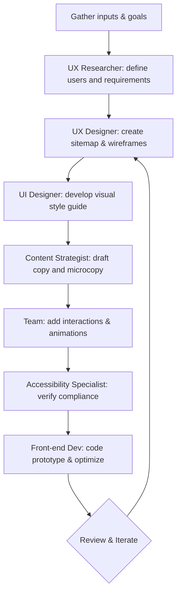

# Website Design Assistant Skill

**Short Description:** A comprehensive AI workflow for end-to-end website design. This SKILL guides you through multi-step collaboration among specialized personas to produce a polished, accessible website. It covers all phases (discovery, layout, style, content, interaction, prototyping) and embeds best-practice checks at each step.

## Purpose & Scope  
This Skill supports designing *any* modern website (landing page, e-commerce, blog, etc.) with high UX/UI quality. Outputs can include low/hi-fi wireframes, Figma mockups, HTML/CSS prototypes, component specs, and accessibility reports. It assumes no strict constraints unless specified in inputs. You may customize brand tone, tech stack, or target platform (web, mobile) per project needs.

## Required Inputs & Pre-Flight Checklist  
Before starting, gather all key project info to avoid ambiguity:  
- **Project Goals & Audience:** Who is the website for? What are the business/UX goals?  
- **Brand & Style:** Brand identity (colors, logos, voice). Any style guides?  
- **Content Inventory:** Existing content or assets (text, images) and required pages/sections.  
- **Functional Requirements:** Core pages/flows (e.g. login, checkout), integrations, and features.  
- **Technical Stack:** Preferred frontend frameworks, CMS, performance targets.  
- **Accessibility Targets:** Compliance level (e.g. WCAG 2.1 AA) and devices/platforms (desktop, mobile).  
- **Success Metrics:** How will we measure success? (e.g. conversions, load time).  

Confirm or fill in any missing details (assume generic values if unspecified). A solid brief ensures the AI team can proceed confidently.

## Personas & Roles

| Role                    | Key Responsibilities                            | Key Questions                          | Deliverables                        |
|-------------------------|-------------------------------------------------|----------------------------------------|-------------------------------------|
| **UX Researcher**       | Conducts user interviews, personas, surveys.    | *Who are our users? What are their goals? What pain points?* | User personas, empathy maps, research findings |
| **UX Designer**         | Defines site structure, wireframes, flows.      | *What pages and flows solve user needs? How to optimize navigation?* | Site map, wireframe sketches, flow diagrams |
| **UI Designer**         | Creates visual style, components, layouts.      | *What colors, typography, and imagery match the brand?* | Style guide (colors, fonts), hi-fi mockups |
| **Content Strategist**  | Plans information architecture and copy.        | *What messages and microcopy (headings, CTAs) are needed?* | Content outline, written copy for pages |
| **Accessibility Specialist** | Ensures inclusive design (WCAG, ARIA).    | *Are contrast, alt-text, and semantics compliant?* | Accessibility checklist/report |
| **Front-End Developer** | Implements design in code, ensures performance.| *How to translate designs into responsive, optimized code?* | HTML/CSS/JS prototype, component specs |

Each persona “asks” targeted questions (listed above) and produces specific outputs. The AI can adopt these roles sequentially or in a pipeline, ensuring expertise at each stage.

## Multi-Step Workflow

1. **Discovery:**  
   - *Who & What:* **UX Researcher** clarifies target users and goals. Ask: “Who is the user, and what top tasks must the site accomplish?” Gather user needs.  
   - *Output:* Research summary or personas; clear project objectives.

2. **Site Structure:**  
   - *Where & How:* **UX Designer** outlines pages and navigation. Ask: “Design a sitemap and key wireframes (e.g. homepage, user flow).”  
   - *Output:* Site map diagram, low-fidelity wireframes for primary pages.

3. **Visual Design System:**  
   - *Look & Feel:* **UI Designer** defines style. Prompt: “Create a mood board and style guide (colors, fonts, imagery).”  
   - *Output:* Color palette, typography settings, example component designs (buttons, form fields).

4. **Content & Copywriting:**  
   - *Voice & Info:* **Content Strategist** generates on-brand copy. Ask: “Write concise microcopy for CTA buttons, form labels, and headings.”  
   - *Output:* Finalized text (headlines, paragraphs, alt text) integrated into layout placeholders.

5. **Interactions & Motion:**  
   - *Dynamics:* Designers add micro-interactions. Task: “Specify animations/feedback for key interactions (e.g. button hover, dropdown animation).”  
   - *Output:* Interaction guidelines, animation specs or prototype demo (e.g. Figma prototype).

6. **Accessibility & Responsiveness:**  
   - *Inclusive UX:* **Accessibility Specialist** reviews: “Check color contrast ≥4.5:1, keyboard navigation, ARIA labels.” Ensure mobile-responsive behavior.  
   - *Output:* Accessibility audit report, list of fixes (e.g. improve contrast, add alt-text).

7. **Prototyping & Code:**  
   - *Build:* **Front-End Dev** creates a working prototype. Task: “Convert designs into responsive HTML/CSS/JS. Optimize assets for performance.”  
   - *Output:* Prototype or code files, performance metrics.

8. **Review & Iteration:**  
   - *Feedback Loop:* The team reviews and iterates. Use “What’s working? What needs tweaking?” based on stakeholder feedback or test data.  
   - *Output:* Refined prototypes, version notes.

At each numbered step, prompt the AI with the role-specific questions and tasks above, verifying acceptance criteria before moving on.

## Best-Practice Rules & Checklists

- **Progressive Disclosure:** Present functionality in layers (basic tasks first, advanced features later) to avoid overwhelming users【59†L52-L58】. *AC:* Core features visible; advanced options hidden until needed.
- **Color Theory:** Use harmonious palettes (e.g. analogous or complementary schemes) to evoke brand mood【61†L312-L320】. *AC:* Color contrast meets WCAG; palette follows 60-30-10 rule.
- **Visual Hierarchy:** Emphasize important content via size, color, or placement. *AC:* Headline prominence ≥ body text, CTAs distinct.
- **Responsive/Grid Layout:** Ensure layouts adapt to all screen sizes. *AC:* Key elements stack or reflow on mobile with no overlap.
- **Typography:** Choose legible fonts and appropriate scale. *AC:* Font sizes ≥16px for body; line lengths ~50–75 chars.
- **Microcopy Tone:** Keep UI text concise, action-oriented, and friendly. *AC:* CTAs start with a verb (e.g. “Get Started”); error messages clear and helpful.
- **Motion Guidelines:** Use animation to guide (e.g. easing for dropdowns) not distract【59†L91-L100】. *AC:* Animations ≤0.5s, non-blocking transitions.
- **Performance Optimization:** Minimize load time. *AC:* Images/web fonts optimized; critical CSS inline.
- **Accessibility:** Follow WCAG standards. *AC:* Text contrast ≥4.5:1; all interactive elements keyboard-accessible【61†L312-L320】.

Incorporate these checks as a final review checklist or automated linting step to ensure a professional outcome.

## Prompt Templates

- **Startup Layout (full page):** *When:* Building a SaaS or startup site. *Prompt:* “Create a modern website for a tech startup: hero banner, feature sections, testimonials, pricing, and contact form. Use a clean layout with plenty of white space. Provide HTML/CSS and explain each section.” *Output:* Full-page layout with code【36†L117-L120】.
- **Landing Page (product):** *When:* Designing a single product page. *Prompt:* “Design a landing page for a productivity app with hero CTA, feature list, demo video, social proof, and pricing. Use dark mode and modern colors.” *Output:* Focused product page design【36†L140-L144】.
- **Blog/Portfolio Site:** *When:* Creating a personal or content-heavy site. *Prompt:* “Generate a minimal blog homepage: cream background, grid of post summaries, author bio, and nav bar. Use a soft color scheme.” *Output:* Blog layout (possibly in Figma or code)【36†L161-L165】.
- **Marketing Site (Figma):** *When:* Need a polished mockup. *Prompt:* “Create a Figma design for a marketing site with a hero, split feature grid, testimonial slider, and signup form. Use balanced white space and soft colors.” *Output:* Figma file with interactive prototype【36†L181-L185】.
- **Contact Form Code:** *When:* Adding or testing contact functionality. *Prompt:* “Generate a contact page form (Name, Email, Message) with JavaScript validation. Ensure fields are required and email format is checked.” *Output:* Working HTML/CSS/JS form【36†L197-L201】.
- **Navigation Menu:** *When:* Improving site menu. *Prompt:* “Design a user-friendly navigation menu for [SiteName]: logical menu labels, dropdowns as needed, and a mobile hamburger. Ensure high-contrast text and keyboard accessibility.” *Output:* Menu wireframe or HTML/CSS snippet【42†L42-L49】.
- **Footer Design:** *When:* Finishing site template. *Prompt:* “Create a website footer with contact info, social links, and site links. Keep it simple and brand-consistent. Show HTML structure.” *Output:* Footer layout and code【14†L83-L90】.
- **Mobile-Ecommerce Homepage:** *When:* Crafting shop front page. *Prompt:* “Design a mobile-responsive homepage for a fashion retailer: fast-loading images, clear CTAs (‘Shop Now’), and easy checkout access. Use a clean, modern style.” *Output:* Responsive mockup with shopping focus【54†L81-L89】.
- **Accessibility Review:** *When:* Auditing an existing design. *Prompt:* “Review this homepage for accessibility. Check color contrast, alt text, keyboard navigation, and form labels. List any violations and fixes.” *Output:* Accessibility report with issues and recommendations.
- **Persona Checklist:** *When:* Validating user alignment. *Prompt:* “Summarize key user personas for this site and list their main goals and preferred content.” *Output:* Persona profiles (beneficial for aligning design).

*(Add additional prompts tailored to your context as needed.)*

## Output Examples  
Request one or more of the following output formats to suit your needs:  
- **Wireframes:** Sketches or annotated images (PNG/PDF) of page layouts.  
- **Figma File:** Shared Figma link or exported frames (with style guide embedded).  
- **Code Prototype:** HTML/CSS/JS snippet or repository link for interactive demo.  
- **Component Spec:** Document (MD or HTML) detailing UI components, CSS variables.  
- **Accessibility Report:** Checklist or HTML report with pass/fail items.

Indicate the desired output in your prompt (e.g. “Provide a Figma prototype…”).

## Prompt Validation Metrics

To choose and refine prompts, track community endorsement metrics:  
```
Likes      : ********** (10)
Stars      : ********** (10)
Installs   : ********   (8)
Comments   : ******     (6)
Forks      : *****      (5)
Shares     : ****       (4)
```  
*Bar chart: Recommended metrics to rate prompts*  

For example, Taskade’s website prompts have **1M+ users**【14†L83-L90】. Figma’s “figgpt” plugin shows **100k installs**【65†L45-L48】. DocsBot lists **75k+ uses**【46†L94-L99】. Prefer prompts/tools with higher counts. Rank prompts by likes/upvotes or stars on GitHub/Twitter. Validate by how often a prompt is shared or forked.

## Troubleshooting & FAQ  

- **Q:** *Prompt isn’t producing the expected style.*  
  **A:** Clarify style adjectives or provide examples. E.g. specify “minimalist, monochrome palette” or attach an example image.  
- **Q:** *AI misunderstood a requirement.*  
  **A:** Refine the prompt to remove ambiguity. Break complex tasks into smaller steps with separate prompts.  
- **Q:** *Resulting design is not responsive or accessible.*  
  **A:** Ensure you included those constraints in inputs/checklist. Re-run accessibility check (WCAG). Example: “Refine CSS for mobile layout.”  
- **Q:** *How to handle iterative feedback?*  
  **A:** Provide the AI with version history or incremental feedback. Use a prompt like “Given this current design, adjust X.”  

Iterate by treating each persona’s output as a checkpoint, revisiting any earlier step if needed.

## Changelog & Attribution  

- **Sources:** Based on high-engagement prompt libraries and guides. Prioritize *Taskade* and *Figma Community* (plugins, files), *GitHub repos*, *Medium/Notion articles*, and active *social threads*. Use official or community-verified examples when citing prompt language.  
- *Mar 2026:* Initial Skill creation with multi-persona workflow (inspired by Claude SKILL formats) and prompt templates from Taskade and design blogs.  
- *Sources include:* AI prompt repositories (Taskade AI Prompts, DocsBot) and UX design blogs, as well as Figma plugin usage stats【14†L83-L90】【65†L45-L48】.


*Flowchart: Multi-persona website design process.*  

