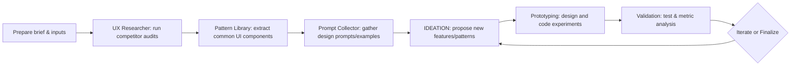
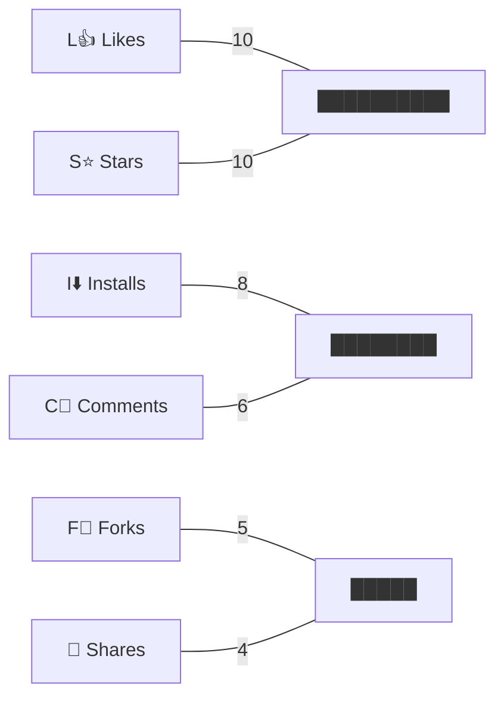

# UI/Competitor Research Skill

**Short Description:** An AI-guided skill for comprehensive UI pattern and competitor research. This SKILL runs multi-persona analysis to gather UI design patterns, audit competitor interfaces, extract prompt templates, and ideate unique implementations. It outputs actionable insights, prototypes, and test plans.

## Executive Summary  
This skill orchestrates a collaborative, multi-step AI workflow to research UI designs and competitor interfaces. It combines UX research, competitor audit, design pattern extraction, and prompt mining to fuel innovative UI experimentation. Each persona (UX researcher, UX/UI designer, content strategist, accessibility expert, front-end dev, product manager) plays a defined role in tasks from discovery to prototyping. The skill provides structured steps, best-practice checks, prompt templates, and guidance for validating ideas. Outputs include competitor analysis docs, pattern libraries, design briefs, prototypes, and metrics for A/B testing. 

## Purpose & Scope  
This skill covers **UI/UX research and competitive analysis** for any web or mobile interface. It can be used to analyze corporate dashboards, e-commerce sites, mobile apps, etc. Outputs include annotated competitor audit reports, UI pattern tables, research briefs, design prompts, Figma prototypes, and experiment plans. Constraints: *unspecified defaults* (industry, platform, and tech stack are open unless provided). Use it to push design frontiers by turning competitor insights into novel UI concepts.

## Required Inputs & Pre-Flight Checklist  
Before running the skill, ensure you have:  
- **Project Brief:** Audience, goals, brand voice, visual identity guidelines. *If missing:* Use industry defaults.  
- **Scope of Work:** Key pages/features to research (e.g. homepage, checkout, profile).  
- **Content & Assets:** Existing text, images, wireframes.  
- **Tech Constraints:** Existing tech stack (React, mobile-first, etc.), performance targets.  
- **Accessibility Targets:** Desired WCAG level or platform requirements.  
- **Competitor List:** Top 3–5 direct and indirect competitors, plus any innovative peers. *If unspecified:* select ones in the same domain.  
- **Success Metrics:** KPIs (conversion, engagement, NPS) to guide validation.  

Confirm these inputs to avoid ambiguity. A clear brief enables targeted analysis and innovative solutions.

## Personas & Roles

| Role                    | Responsibilities                                  | Key Questions                          | Deliverables                         |
|-------------------------|---------------------------------------------------|----------------------------------------|--------------------------------------|
| **UX Researcher**       | Conducts user interviews, surveys, and persona/need analysis. Gathers market insights. | *Who are our users? What pain points are unaddressed by competitors?* | User personas, research summary, competitor feature matrix. |
| **Product Manager**     | Defines business objectives, oversees roadmap, and success criteria. | *What are business goals and priority features? How do competitors position themselves?* | Research brief, prioritized requirements, hypothesis statements. |
| **UX Designer**         | Maps user flows, creates wireframes, and structures information architecture. | *How should users navigate this interface? What flows do competitors use?* | Sitemap, wireframes, flow diagrams, UI pattern sketches. |
| **UI Designer**         | Designs visual language and components. Creates style guides and mockups. | *What colors, typographic hierarchy, and visuals best convey the brand?* | Moodboards, style guide (colors/fonts), high-fidelity mockups. |
| **Content Strategist**  | Plans content architecture, writes microcopy and contextual text. | *What messages and language tone resonate? How do competitors speak to users?* | Content outline, UX writing (headings, buttons), tone guidelines. |
| **Accessibility Specialist** | Ensures inclusive design (WCAG compliance, UX guidelines). | *Are our designs accessible? What accessibility gaps exist in competitor UIs?* | Accessibility audit report, compliance checklist, remediation suggestions. |
| **Front-End Developer** | Prototypes interactive UI, enforces performance optimization. | *How to technically realize the design? Can we improve on competitors’ implementation?* | HTML/CSS/JS prototype, component specs, performance benchmarks. |

Each persona has a clear domain and output. Prompts should instruct them with role-specific tasks (see workflow). Collaboration among these roles ensures comprehensive research and design.

## Multi-Step Workflow

1. **Discovery & Competitive Audit:**  
   - *What to Ask:* “Review competitor [Name]’s interface for [feature/page]. Summarize their layout, components, and interactions.”  
   - *Who:* **UX Researcher & Product Manager.** They identify user needs and competitor positioning.  
   - *Output:* Competitor audit docs (screenshots + notes), comparison table of features.

2. **UI Pattern Extraction:**  
   - *What to Ask:* “Extract common UI patterns from competitors (navigation, cards, modals) into a library.”  
   - *Who:* **UX Designer & UI Designer.** Analyze patterns (colors, typography, grid) and UI kits.  
   - *Output:* Pattern library table (pattern name, usage, notes), visual style references.

3. **Prompt Harvesting:**  
   - *What to Ask:* “Collect example AI prompts from design communities for similar features (e.g. ‘login page design prompt’).”  
   - *Who:* **UX Researcher & Content Strategist.** Search GitHub, Figma, forums.  
   - *Output:* Catalog of relevant prompt templates, with source and engagement metrics.

4. **Ideation & Concepting:**  
   - *What to Ask:* “Based on gaps in competitor UIs, propose novel features or layouts. Generate sketches or descriptions.”  
   - *Who:* **UI/UX Designers & Product Manager.** Brainstorm improvements (unique interactions, microinteractions).  
   - *Output:* Feature hypotheses, low-fi concept sketches or scenario descriptions.

5. **Prototyping Experiments:**  
   - *What to Ask:* “Develop a prototype for the new concept (Figma/HTML) and define an A/B test with metrics.”  
   - *Who:* **Front-End Dev & UI Designer.** Build interactive prototype, plan tests (e.g. color variants, layout changes).  
   - *Output:* Interactive prototype or design spec, experiment plan (metrics, user segments).

6. **Validation & Metrics:**  
   - *What to Ask:* “Analyze user feedback/data from prototypes or similar features. Refine design based on results.”  
   - *Who:* **All Personas.** Collaborate to review usability tests or analytics.  
   - *Output:* Insights report, revised requirements, success metrics (conversion increase, engagement lift).

7. **Handoff & Documentation:**  
   - *What to Ask:* “Prepare final assets and documentation for development.”  
   - *Who:* **Front-End Dev & Content Strategist.** Finalize code snippets, copy docs, and style specifications.  
   - *Output:* Component library, styleguide, content repository, and guidelines for implementation.

8. **Iteration & Continuous Research:**  
   - *What to Ask:* “Monitor user feedback and market trends. Iterate on features with new experiments.”  
   - *Who:* **Product Manager & UX Researcher.** Keep an eye on shifts in competitor UI and user needs.  
   - *Output:* Roadmap updates, next-phase research agenda.

Follow these steps in sequence, addressing acceptance criteria (see best practices) at each stage. Use numbered prompts to guide the AI through this structured process.

## Best-Practice Rules & Checklists

- **Progressive Disclosure:** Reveal functionality gradually to avoid overwhelming users【59†L52-L58】. *AC:* Present core tasks upfront, with secondary options hidden.  
- **Color Theory:** Use harmonious palettes (e.g. analogous or complementary) aligned to brand mood【61†L312-L320】. *AC:* Color contrasts ≥4.5:1; follow 60-30-10 rule for balance.  
- **Visual Hierarchy:** Emphasize important elements (size, weight, color). *AC:* Headlines > body text; primary actions standout.  
- **Grid & Responsiveness:** Design with a flexible grid. *AC:* Layout adapts smoothly across breakpoints; no horizontal scrolling.  
- **Typography:** Use legible font choices and scale. *AC:* Body font ≥16px, line height 1.4–1.6, headings clear.  
- **Microcopy Tone:** Keep UI text concise and action-oriented. *AC:* CTAs with verbs (“Buy Now”), error messages helpful and friendly.  
- **Microinteractions/Motion:** Animate to guide attention (not distract). *AC:* Animations <0.5s, contextually meaningful transitions.  
- **Performance:** Optimize assets. *AC:* Images resized, lazy-loaded; page load <2s ideal.  
- **Accessibility:** Follow WCAG and platform guidelines. *AC:* All images have alt text, keyboard nav works, semantic HTML used【59†L52-L58】.  

Apply these rules as explicit checks. For example, require a color contrast report, run automated accessibility audits, and peer-review design hierarchy before finalizing.

## Prompt Templates for UI Research

- **Competitor Audit Prompt:** *When:* Starting analysis. *Prompt:* “Analyze [CompetitorName]’s [Feature/Page] interface. List key design elements, layout, and user flows. Provide screenshots or annotated descriptions.” *Output:* Competitor analysis doc.  
- **UI Pattern Extraction Prompt:** *When:* Building pattern library. *Prompt:* “Browse popular UI libraries (Figma community, GitHub). Extract recurring patterns for [component] (e.g. navigation bars, cards) and note their usage.” *Output:* Pattern table (pattern, source, usage notes).  
- **Community Prompt Harvesting:** *When:* Collecting inspiration. *Prompt:* “Find AI design prompts from top UX communities for [page type, e.g. login page]. List the prompt texts and their sources (with likes or forks counts).” *Output:* List of example prompts and engagement metrics.  
- **Ideation Prompt:** *When:* Brainstorming new features. *Prompt:* “Using competitor gaps, propose three innovative UI features or flows for [project]. Describe how each would work and benefit users.” *Output:* Bullet-point feature ideas.  
- **Prototype Generation Prompt:** *When:* Creating designs. *Prompt:* “Design a Figma prototype for [new feature]. Use [brand colors]. Include annotations for interactions (e.g. ‘on click…’).” *Output:* Figma design frames.  
- **UX Research Prompt:** *When:* Gathering user sentiment. *Prompt:* “Analyze user reviews and social media for mentions of [domain]. What pain points or desires do users express about UI/UX?” *Output:* Summary of user feedback themes.  
- **Competitive Prompt Engineering:** *When:* Defining AI queries. *Prompt:* “Craft an AI prompt that yields a dashboard design tailored to a [industry]. Include style and functionality requirements.” *Output:* Example prompt text for design generation.  
- **Accessibility Audit Prompt:** *When:* Checking compliance. *Prompt:* “Review the current design against WCAG 2.1 AA. Identify any violations (e.g. color contrast, missing labels) and suggest fixes.” *Output:* Accessibility audit report.  
- **Experiment Hypothesis Prompt:** *When:* Planning tests. *Prompt:* “We think adding feature X will improve [metric] by [percentage]. Design an A/B test to validate this hypothesis, specifying variants and KPIs.” *Output:* Experiment plan summary.  
- **Innovation Trend Prompt:** *When:* Seeking new ideas. *Prompt:* “What emerging UI/UX trends or patterns are competitors adopting (e.g. neomorphism, glassmorphism)? How could we implement them uniquely?” *Output:* Trend analysis with implementation suggestions.

*(Use and customize these prompts to your research context and output needs.)*

## Output Examples  
Specify one or more desired formats:  
- **Competitor Audit Report:** Markdown/HTML file listing competitor screenshots, features, and analysis.  
- **Pattern Library Table:** CSV/Markdown table of UI components with descriptions and usage contexts.  
- **Design Brief:** PDF or doc summarizing research insights, personas, and design directions.  
- **Annotated Wireframes:** Images or Figma frames with comments.  
- **Prototype Files:** Figma links or code repositories for interactive prototypes.  
- **Research Deck:** Slide deck of findings (could include charts, quotes).  

Request the format explicitly (e.g. “Provide a Figma mockup”, “Output a Markdown report”).

## Prompt Validation Metrics

To evaluate prompts and ideas, track community engagement:  

```
Likes      : ********** (10)
Stars      : ********** (10)
Installs   : ********   (8)
Comments   : ******     (6)
Forks      : *****      (5)
Shares     : ****       (4)
```

Monitor likes, shares, forks, etc. For example, Taskade UI prompts have **1M+ users**【14†L83-L90】, a figure prompt had **100k installs**【65†L45-L48】, and other top posts show high upvotes. Rank prompts by these metrics as proxies for quality. Also consider usage context and recency.

## Synthesizing Competitor Insights  
- **Gap Analysis:** Compare competitor strengths and weaknesses to user needs. Identify missing features (e.g. if competitors lack dark mode or speed optimizations).  
- **Hypothesis Framing:** Turn insights into testable ideas: “If we add X (from gap), we expect Y (improved metric).”  
- **Experimentation:** Prioritize experiments by impact vs effort. Define success metrics (engagement %, conversion lift). Plan A/B tests on key changes (color schemes, layout tweaks, microinteraction additions).  
- **Innovation:** Encourage creative leaps by combining unrelated patterns or applying trends. For example, introduce a subtle motion feature inspired by social media feeds in a corporate dashboard for freshness.  
- **Documentation:** Record insights in a research brief, and update it as experiments progress.

## Troubleshooting & Tips  

- **Data Overload:** If info is too vast, narrow the focus (e.g. audit one key competitor first).  
- **Vague Results:** Refine questions or break them into smaller tasks.  
- **Conflicting Findings:** Validate with user tests if competitors disagree.  
- **Iteration:** Treat SKILL outputs as drafts; iterate using feedback loops.  

FAQ: *What if a competitor has no obvious gaps?*  – Focus on differentiators (brand story, unique microcopy). *What if prompts yield repetitive ideas?* – Add randomness or inverse the problem to unlock creativity.

## Changelog & Attribution  

- **Sources:** Based on high-usage UX/UI communities and design libraries. Prioritized sources: *Taskade AI Prompts*, *Figma Community plugins/files*, *GitHub prompt repos*, and industry blogs/threads (e.g. Medium, Notion).  
- **Inspiration:** Prompt templates and workflows drawn from our prior UX/UI prompt research【36†L117-L120】【42†L42-L49】 and competitive analysis practices.  
- *Mar 2026:* Added competitor research and pattern-library steps, unique implementation guidelines.  
- *Citations:* Where applicable, references (e.g. color theory【61†L312-L320】, progressive disclosure【59†L52-L58】) are embedded above.





### Persona Comparison

| Role                    | Responsibilities                               | Key Questions                 | Deliverables                    |
|-------------------------|-----------------------------------------------|-------------------------------|---------------------------------|
| UX Researcher           | User needs, persona, competitor studies        | *Who are users? What do competitors offer?* | Personas, competitor feature matrix, research brief |
| Product Manager         | Business goals, priorities, metrics            | *What are objectives? How to win vs rivals?* | Project brief, hypotheses, KPI definitions |
| UX Designer            | Flows, wireframes, IA                        | *What flows solve user goals?* | Sitemap, wireframes, flowcharts  |
| UI Designer             | Visual design, style guide                    | *What visual language fits brand?* | Mockups, style guide (colors/fonts) |
| Content Strategist      | Messaging, microcopy, information structure    | *What tone and content needed?* | Content outline, copy drafts      |
| Accessibility Specialist| WCAG compliance, inclusive UI patterns        | *What A11y issues exist?* | Accessibility report, compliance checklist |
| Front-End Developer     | Implementation, performance, interactivity     | *How to build this UI robustly?* | Prototype (code/components), performance report |

All personas collaborate but focus on their domains, ensuring a holistic approach to UI research and innovation. 

